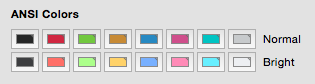
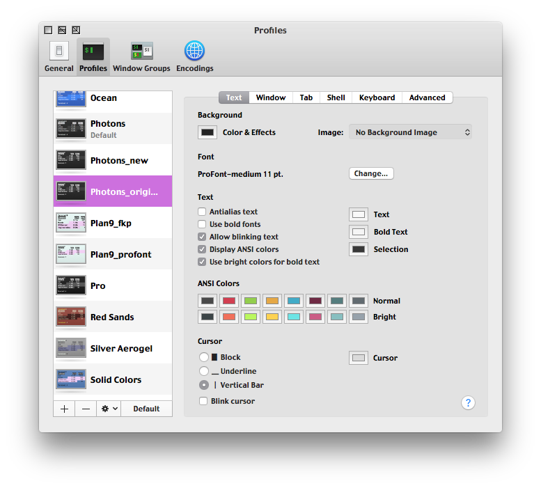
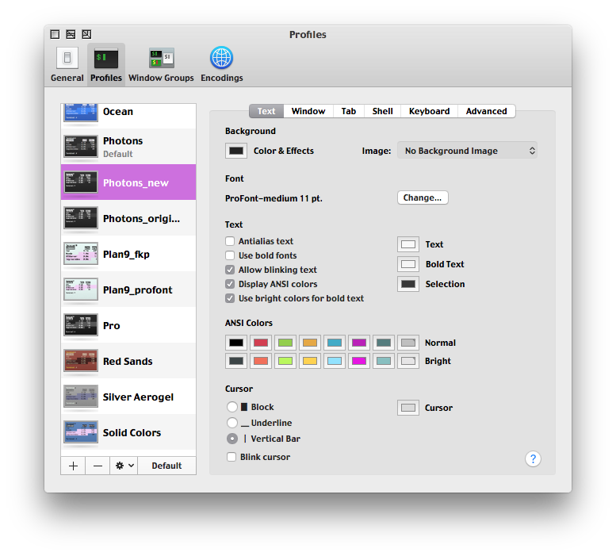
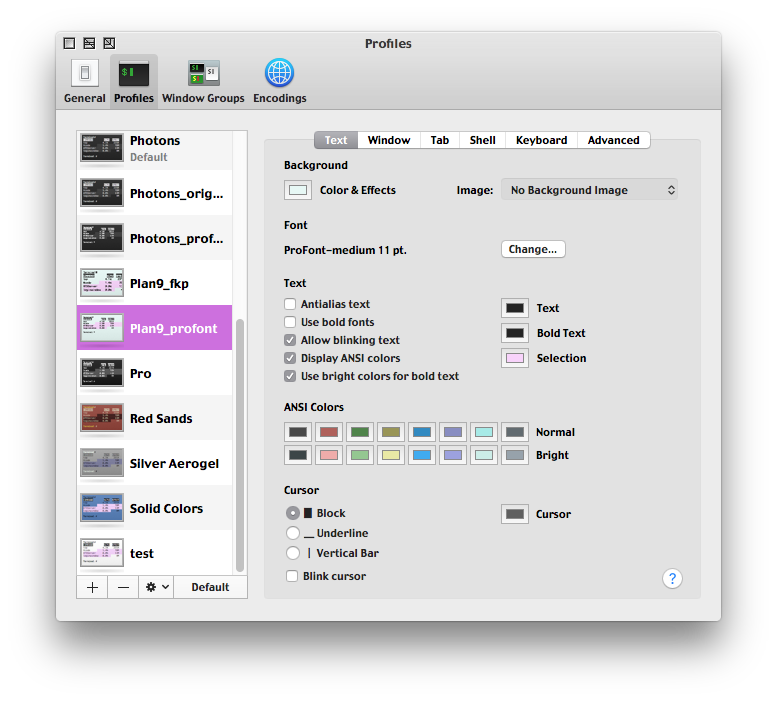
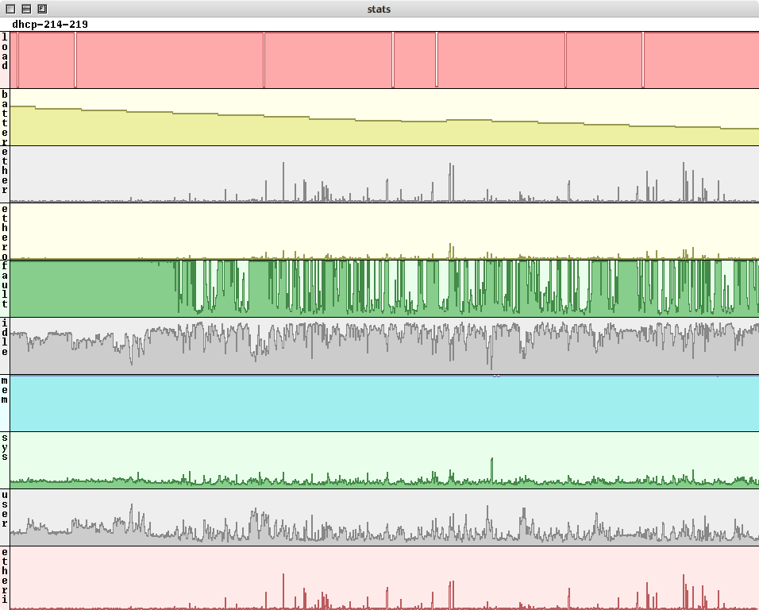

# Terminal.app-Color-Themes
A set of color themes for Apple's built in Terminal.app. Tested on 10.11

Joe
-------------------------------

Photons (original)
-------------------------------

Photons (new)
-------------------------------

Plan9 (color dropped directly from the OS)
-------------------------------

